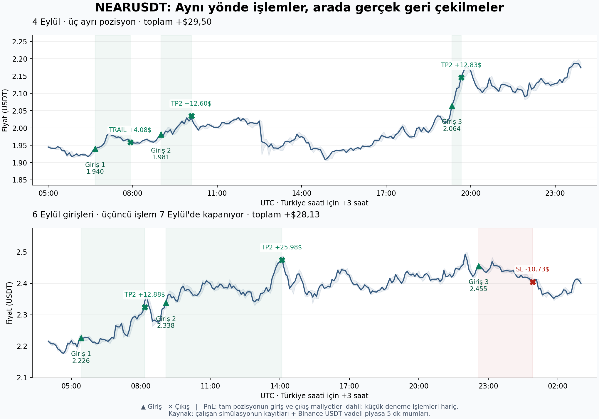

# NEARUSDT: tekrar giriş mi, tek pozisyon mu?

İnceleme: 10–11 Eylül 2026. Saf simülasyon; PnL sanal cüzdanın sonucudur.
Çalışan botta kod, parametre veya servis değişikliği yapılmadı.

## Değerlendirme

Günlük tek işlem kotası için destek yok. İşlemler mükerrer değil: pozisyon
kapanıyor, bekleme ve yeni sinyal/teyit sonrasında yeniden açılıyor.
BULL, dört saatlik veriden üretilen yavaş bir giriş filtresi; kesintisiz yükseliş
veya rejim sonuna kadar açık tutma emri değil.

TP2'yi kaldırmak ayrı bir fikir. Gösterilen Eylül işlemlerinde kârı azaltıyor;
240 günlük portföy testinde ise artırdı. Birkaç işlem, çıkış kuralının genel
başarısını temsil etmez. 665g testi de tamamlandı: daha az kâr, daha büyük
bakiye düşüşü ve bir ek hard stop üretti. **N1 adayı reddedildi. Mevcut TP2'yi
ve yeniden giriş düzenini koruma önerisi; günlük kota ekleme yok.**

## Çalışan sistem ve gerçek işlemler

10 Eylül'de `breakoutbot-test` aktifti. Sürecin ortamında X_* override yoktu;
sunucunun config.py ve strategy.py dosyaları yerelle aynıydı.
DEPLOYED_SHA: dded71b. Eski X_TRAIL_ATR=2.5 uyarısı bu süreç için geçerli değil.

Geometri: SL 2.25 ATR; TP1 3 ATR'de yalnız trail'e geçiş, satış yok; TP2 6 ATR'de
tam kapanış; trail 3.75 ATR; faz başına timeout 96 adet 5 dk bar. TP1'de sayaç
sıfırlandığından toplam üst sınır yaklaşık 16 saat. Kapanıştan sonra 10 bar
cooldown, ardından yeni probe ve teyit gerekiyor. Aynı sembolde eşzamanlı iki
full pozisyon açan bir yapı yok.

Ekrandaki tarih/saat **kapanıştır**. Aşağıdaki saatler UTC; Türkiye +3 saat.
Net PnL giriş ve çıkış yürütme maliyetleri dahil, küçük probe işlemleri hariçtir.
Ekrandaki çıkış PnL'sinden bu nedenle biraz küçüktür.

| Giriş | Kapanış | Fiyat giriş → çıkış | Çıkış | Başlangıç riski | Full net |
|---|---|---|---|---:|---:|
| 4 Eyl 06:40 | 4 Eyl 07:55 | 1.940 → 1.958380 | TRAIL | $5 | +$4.08 |
| 4 Eyl 09:00 | 4 Eyl 10:05 | 1.981 → 2.034693 | TP2 | $5 | +$12.60 |
| 4 Eyl 19:20 | 4 Eyl 19:40 | 2.064 → 2.145664 | TP2 | $5 | +$12.83 |
| 6 Eyl 05:25 | 6 Eyl 08:10 | 2.226 → 2.324293 | TP2 | $5 | +$12.88 |
| 6 Eyl 09:05 | 6 Eyl 14:05 | 2.338 → 2.474520 | TP2 | $10 | +$25.98 |
| 6 Eyl 22:35 | 7 Eyl 00:55 | 2.455 → 2.404428 | SL | $10 | −$10.73 |

4 Eylül toplamı **+$29.50**, 6 Eylül'de açılanların toplamı, ertesi günkü SL
dahil, **+$28.13**. Yalnız ilk full işlemi bırakıp sonraki girişleri kayıttan
çıkarmak sırasıyla **$25.42 ve $15.25** kazancı elerdi. Bu, gözlenen katkıdır;
sinyalleri ve portföyü yeniden hesaplayan günlük kota backtest'i değildir.

Yaklaşık $13 / $26 TP2 farkı kısmi satıştan kaynaklanmıyor. Hesap zirvesinden
düşüş nedeniyle risk yarılanmıştı; 6 Eylül 08:15 UTC'de throttle kapandı.
05:25 girişinde risk $5, 09:05 girişinde $10. Ekrandaki sabit $10 etiketi bunu
göstermiyor.



## Aynı girişlerde TP2 olmasaydı

Binance USDT vadeli piyasanın 4–7 Eylül tarihli 1.152 adet 5 dk mumu indirildi.
Mum zamanları açılış; kayıtlarla karşılaştırırken kapanış için 5 dakika eklendi.
Gerçek girişler, kayıtlardan yeniden kurulan ATR/büyüklük ve mevcut SymbolState
çıkış kodu kullanıldı. Altı kontrol işleminin çıkış zamanı, türü ve fiyatı aynı;
PnL farkı kayıtların dört ondalığa yuvarlanması düzeyinde. ATR, TP2/SL mesafesinden;
ilk TRAIL için önceki tepe ile çıkış arasından türetildi. Büyüklüğün kaydedilen
giriş ücretiyle tutarlılığı ayrıca kontrol edildi.

Yalnız TP2 erişilemez yapıldı; trail ve timeout korundu:

| Gerçek giriş | Mevcut full net | TP2 yokken full net | Yeni kapanış (UTC) |
|---|---:|---:|---|
| 4 Eyl 06:40 | +$4.08 | +$4.08 | 07:55 TRAIL, aynı |
| 4 Eyl 09:00 | +$12.60 | +$4.83 | 10:15 TRAIL |
| 4 Eyl 19:20 | +$12.83 | +$11.41 | 20:10 TRAIL |
| 6 Eyl 05:25 | +$12.88 | +$10.07 | 08:30 TRAIL |
| 6 Eyl 09:05 | +$25.98 | +$11.75 | 14:25 TRAIL |
| 6 Eyl 22:35 | −$10.73 | −$10.73 | 7 Eyl 00:55 SL, aynı |

Bu eşleşmiş girişlerde çıkış teşhisidir; yeni sinyalleri, cooldown değişimini,
throttle'ı ve diğer coinlerle slot rekabetini tekrar üreten portföy testi değil.
İlk 6 Eylül çıkışını 20 dakika geciktirmek, gerçek 09:05 girişinin aynı şekilde
yapılacağını garanti etmez.

## Tek kesintisiz tutuşun geriye dönük hesabı

4 Eylül 09:00'daki aynı miktarı 19:40 çıkış fiyatına kadar taşımak teoride
**+$40.15**, iki gerçek TP2 **+$25.42** eder. Fakat fiyat arada önceki tepeden
yaklaşık **%6.48** geri çekilmişti. Mevcut trail 10:15'te kapatırdı. Akşam
fiyatına dayanabilmek için trail başlangıç ATR'sinin yaklaşık **14.75 katından
büyük** olmalı, timeout da uzamalıydı. Bu sayı öneri değildir; sonradan seçilen
tutuşun ne kadar farklı risk davranışı gerektirdiğini gösterir.

6 Eylül 05:25'teki **aynı miktarı** 14:05'teki ikinci TP2 fiyatına kadar tutmak
teoride **+$33.26**; iki gerçek işlem **+$38.86** kazandırmıştı. İkinci işlem
iki kat başlangıç riski taşıdığı için eşit risk kıyası değildir. İkisini de
$5 riske normalize edersek toplam **+$25.87**. Fakat tek tutuş mevcut trail'den
geçemez: 08:30'da **+$10.07** ile kapanırdı; aradaki geri çekilme **%4.31**.

Başlangıç ve son fiyatı birleştirmek, aradaki stopları ve sonradan seçilmiş
çıkışı yok saydığı için uygulanabilir strateji kanıtı değildir. Daha geniş
başlangıç stopunda aynı dolar riskini korumak için büyüklük de küçülmelidir.
[CME'nin pozisyon büyüklüğü açıklaması](https://www.cmegroup.com/education/courses/trade-and-risk-management/proper-position-size)
stop mesafesi–risk–büyüklük bağlantısını anlatıyor.

## 240 günlük kontrollü portföy deneyi

Veri: 27 Aralık 2025–24 Ağustos 2026; 40 gün rejim ısınması ayrıca var.
Eylül örneği dahil değil. Beş coin, ortak $1000 hesap, mevcut risk kapıları ve
yürütme maliyetleri. Altı veri dosyasının hash'leri cache_manifest.json içinde.

```sh
./experiments/run_arm.sh N1-control-20260910 240
./experiments/run_arm.sh N1-no-tp2-20260910 240 X_TP2_ATR=inf
python3.12 experiments/ledger.py 240
```

| Ölçü | Güncel kontrol | TP2 yok; trail/timeout aynı |
|---|---:|---:|
| Net hesap kârı | +$435.46 | **+$540.58** |
| Son bakiye | $1435.46 | $1540.58 |
| Full işlem | 114 | 114 |
| Gerçekleşmiş bakiye MaxDD | −%6.14 | −%6.23 |
| Hard stop | 0 | 0 |
| Giriş maliyetleri (tüm işlemler) | $84.64 | $84.64 |
| TP2 / SL / TRAIL / TIMEOUT | 35 / 45 / 31 / 3 | 0 / 42 / 65 / 7 |
| MAX_OPEN doluyken işlenen teyit barı | 4 | 10 |

Kontrol, eski benimsenmiş R1-sl225t96_240d sonucunun **1.318 bacağını ve son
bakiyesini birebir** yeniden üretti. İki koşu 240 günü tamamladı; açık bacak
kalmadı; mutabakat hatası yaklaşık sıfır. MAX_OPEN sayacı, teyit başarısız
olacakken de artabilir; 4→10 sayısı kesin kaçırılmış geçerli giriş sayısı değildir.

Artış **+$105.12**; bunun **+$93.72'si INJ** katkısındaki artış. Coin katkıları
tüm giriş/çıkış maliyetleri ve probe'lar dahil:

| Coin | Kontrol | TP2 yok | Fark |
|---|---:|---:|---:|
| NEAR | +$56.82 | +$83.13 | +$26.31 |
| INJ | +$186.77 | +$280.49 | +$93.72 |
| ADA | +$43.05 | +$78.53 | +$35.48 |
| POL | +$91.06 | +$82.82 | −$8.24 |
| UNI | +$57.76 | +$15.60 | −$42.16 |

114 girişin 110'u eşleşiyor. İki eşleşen INJ işleminin ek kârı $111.94;
toplam farktan büyük. Kuyruk kazançlarına bağımlılığı gösterir; trend takipçide
beklenebilir ama genellenebilirlik konusunda ek veri gerektirir. İşlem sayısı
ve ücretin değişmemesi, “çok işlem ücret yiyor” teşhisinin bu deneyin kazanç
nedenini açıklamadığını gösteriyor.

## 665 günlük karşılaştırma

11 Eylül'de başlatıldı:

```sh
./experiments/run_arm.sh N1-no-tp2-20260910 665 BT_RESTARTS=1 X_TP2_ATR=inf
```

Referans: kayıtlı R1-sl225t96_665d; bakiye $1085.22, net +$85.22,
gerçekleşmiş bakiye MaxDD −%37.56, 396 full, 3 hard stop.
BT_RESTARTS=1, hard stop sonrası operatörün yeniden başlatmasını modeller;
çalışan botun kendi kendine yeniden başlaması değildir. Güncel çekirdek
dosyaları benimsenmiş sürümle aynı; taze 240g kontrolü eski bacakların tamamını
tekrar üretti. 665g kontrolü bu incelemede yeniden koşturulmadı.

### Tamamlanan sonuç ve karar

| Ölçü | Güncel kontrol (kayıtlı) | TP2 yok (yeni koşu) |
|---|---:|---:|
| Net hesap kârı | **+$85.22** | +$68.89 |
| Son bakiye | $1085.22 | $1068.89 |
| Full işlem | 396 | 387 |
| Gerçekleşmiş bakiye MaxDD | **−%37.56** | −%45.57 |
| Hard stop / varsayımsal restart | **3** | 4 |
| Giriş maliyetleri | $222.67 | $215.30 |
| TP2 / SL / TRAIL / TIMEOUT | 83 / 203 / 99 / 11 | 0 / 193 / 175 / 19 |

İki kayıt da 665.0069 günü tamamladı; açık bacak yok, mutabakat hatası ~0.
Adayda TP2 gerçekten sıfır. Yeni adayın 5.090 bacağı sonuç dosyasına kaydedildi.
Kâr farkı **−$16.33**, MaxDD farkı **8.01 yüzde puan kötüleşme**. Kâr farkı
tek başına hangi kuralın daha iyi olduğuna ilişkin istatistiksel kanıt değildir; ancak projenin
iki pencerede birden daha iyi hesap getirisi şartı geçilmedi ve gözlenen risk
davranışı da kötüleşti. **N1-no-tp2-20260910 benimsenmedi; çalışan ayarlar aynı.**

NEAR'ın tüm maliyetler dahil portföy katkısı 665g'de −$54.53'ten −$9.19'a
iyileşti; 240g'de de iyileşmişti. Bu, yalnız NEAR'da farklı çıkış denemesi için
bir araştırma ipucu olabilir. Fakat sonuç bütün beş coinin çıkışı değişmiş bir
portföyden geliyor; NEAR'a özel kuralın sonucu değildir. Böyle bir seçim ayrı
kontrol, portföy replay'i ve yeni dönem doğrulaması ister. Eylül'deki eşleşmiş
NEAR girişlerinin dört TP2 kazancının da kötüleştiği bulgusu ayrıca korunuyor.

Son karar: **Günlük tek işlem kotası ekleme; global TP2'yi kaldırma.** TP2'de
kısmi kapanış veya başka süre ölçeğinden trail ayrı, test edilmemiş hipotezlerdir.
Bu inceleme onları uygulamayı gerekçelendirmiyor.

## Sınırlar ve seçenekler

- 240g, 665g'nin içinde; bağımsız iki örneklem değiller. İki pencereyi geçmek
  gerekli proje eleğidir, tek başına istatistiksel güvence değildir. Yeni dönem
  doğrulaması ayrıca değer taşır.
- Standart backtest funding uygulamıyor. Drawdown gerçekleşmiş bakiyeye göre;
  açık pozisyonların bar içi zararı/kâr geri vermesi dahil değil. Uzun tutuş
  önerisinde bu özellikle önemlidir.
- Günlük kota ve cooldown uzatma genel portföy kuralı olarak test edilmedi.
  Gözlenen sonraki işlemler net kârlı; doğrudan uygulamak için gerekçe yok.
- TP2'de bir kısmını kapatıp kalanını taşımak veya daha yavaş zaman diliminden
  çıkış almak ayrı hipotezler. Bu çalışma o yapıları doğrulamıyor. Geniş
  stop/süreyi birkaç Eylül mumuna göre seçmekten kaçınılmalı.

Çıkış teşhisini tekrar çalıştırmak: `python3.12 experiments/reports/20260910-near/replay_analysis.py`.

Dosyalar: paired_trades.json, near_5m.csv, replay_results.json,
continuous_results.json, portfolio_comparison.json. Deney tanımı ve karar
experiments/DEFTER.md'ye kaydedilir.
